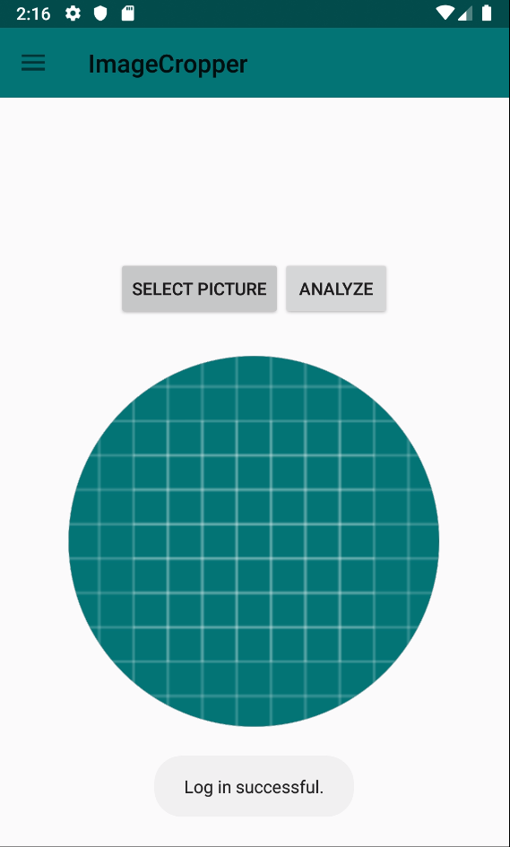
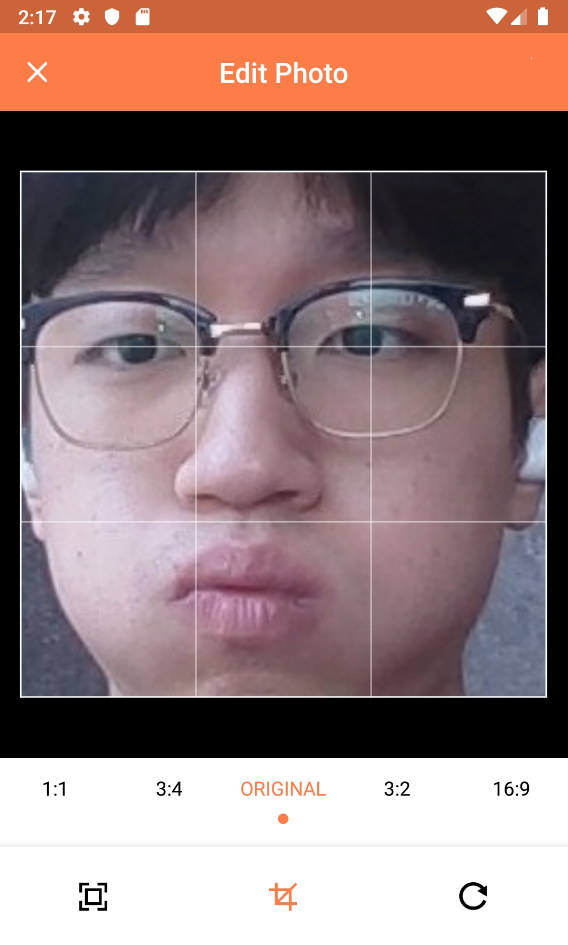
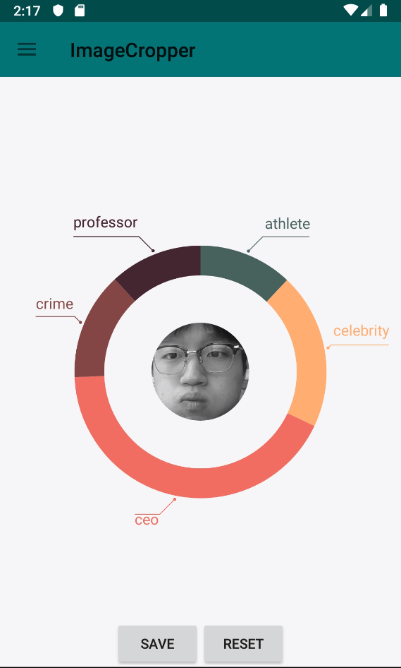
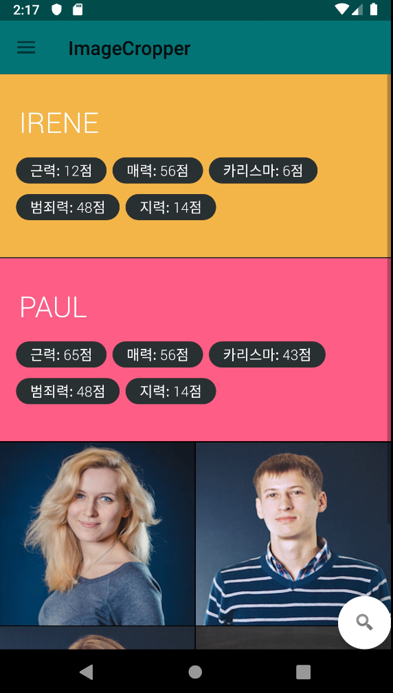
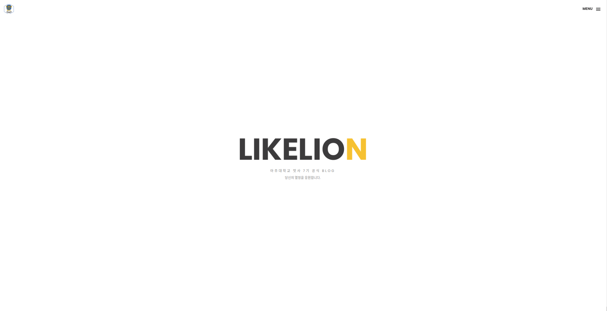
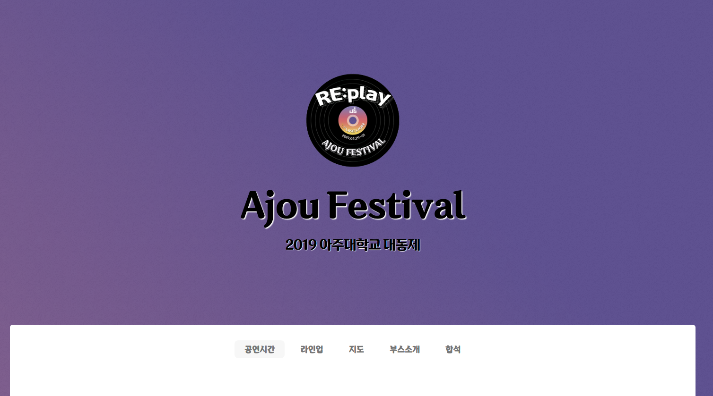
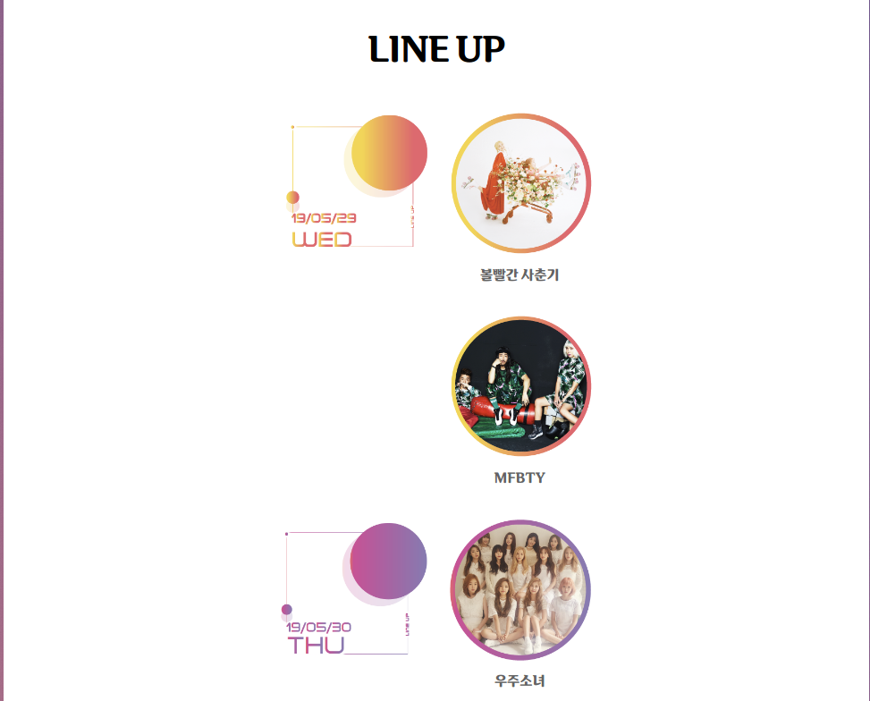
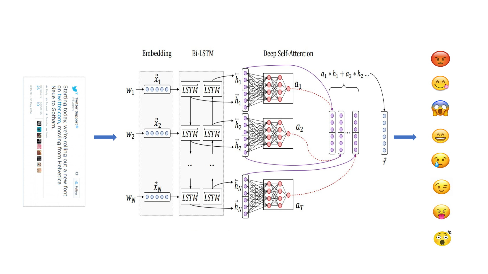

# Naver Developer Open Class 2019
> 네이버 Open class 2019 첨부자료입니다.

## `2019 관상분석 어플리케이션` (`Android`, `tfLite`)
**[github 링크](https://github.com/minkj1992/android_facial_analysis)**

- `프로젝트 주제`: 얼굴 이미지를 5가지값으로 관상분석 딥러닝하여 `근력`,`지력`,`재력`,`카리스마`,`범죄력`을 보여주고, 다른 사람들의 분석결과를 공유할 수 있는`Android App`(`JAVA`).

- `사진 select`

- `사진 cropper`

- `관상 analysis`

- `관상 gallery`

- 19년 4월 안드로이드를 공부하며 약 두달간 만들었습니다.
- `firebase`, `android`, `여러 library`들을 사용할 수 있었습니다.
- 혼자 작업하였습니다.

## `2019 아주대 멋쟁이사자처럼 Blog`(`Django`)
**[github 링크](https://github.com/minkj1992/BlogAjouLikelion2019)**

- 아주대 2019년 멋쟁이사자처럼 블로그 웹페이지를 만들었습니다.
- 혼자서 작업하였습니다.

## `2019 아주대 축제사이트` (`Django`)
**[github 링크](https://github.com/minkj1992/ajouFestival2019)**

- 2019년 아주대 여름 축제용 웹사이트를 개발하였습니다.
- 부스소개, 라인업 소개, 합석 시스템, `Django`로 개발, `heroku`를 사용하여 배포하였습니다.
- 멋쟁이사자처럼 친구 6명과 함께 작업하였습니다.
    - 저는 멘토로 참여하였으며, `배포` 및 `디버깅` 하였습니다.

## `2019 아주대 병원 환자데이터 관리 사이트` (`Django`, `MySQL`)
**[github 링크](https://github.com/minkj1992/AJOU_HOSPITAL_TUMOR)**

- 아르바이트로 아주대 병원 간호사 의사선생님 용 Trauma와 Tumor 환자 관리사이트를 개발 하였습니다.
- 혼자 작업하였습니다.

    

## `2018 경기도 E-UR 공학: 한글문장 11가지 감정분류`(`Keras`)
**[github 링크](https://github.com/minkj1992/Korean_emotion_classification_attention)**

- **짧은 한글 sns 문장을 8가지 감정으로 분류하는 모델입니다.**

- **[실행 영상]**(https://drive.google.com/file/d/11dz5uotQoyySi1gSwy9djZO9K4sAboeFview?usp=sharing)
- **[발표 영상]**(https://drive.google.com/file/d/1Z2h8hQKjZHRX5t6ZbE_BVEzPDJ7ZCYVyview?usp=sharing)

- 수상하여 `싱가폴 난양대학교`로 10일간 학술 교류회를 다녀올 수 있었습니다.
- 카카오톡과 같은 짧은 메시지에서 `감정분류`를 해보고 싶어, 아무것도 모르는상태로 `케라스`를 배우고 `논문`을 읽으며 `자연어`처리 모델링(`bi-lstm``Attention`)을 연구했으며, `라벨링된 한글 텍스트 데이터`를 구하기 위해 발품을팔면서 데이터를 구했습니다. `word2vec`를 학습시키기 위해 `selenium` `크롤링`을익혔고 `우분투 환경`에서 작업을 하였습니다. 
- 혼자 작업하였습니다.
    

## `2018 아주대 축제사이트` (`RoR`)
**[github 링크](https://github.com/minkj1992/ajouFestival2018)**
- 2018년 아주대 여름 축제용 웹사이트를 개발하였습니다.
- 팀원으로 참여하였습니다. (주점 검색)

## `2019 알고리즘 공부 organization`
**[github 링크](https://github.com/ajouswea/Ajou_SWEA)**
취업 준비를 위하여 꾸준히 알고리즘을 풀어보고 이론들을 정리해보고 있습니다.

